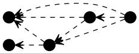
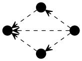

### Type:ALL - Article - 1-inf - 1980-2015
#### doctype:Article
|order|motif|frequency|
|:----:|:-----:|:----:|
|1||9684388|
|2||2102462|
|3||923228|
|4||905782|
|5||768176|
|6||446247|
|7||436196|
|8||300815|
|9||256757|
|10||114727|### Type:ALL - Article - 5-inf - 1980-2015
#### doctype:Article
|order|motif|frequency|
|:----:|:-----:|:----:|
|1||8582064|
|2||1978875|
|3||847744|
|4||846729|
|5||727686|
|6||435416|
|7||426054|
|8||289535|
|9||251436|
|10||114727|### Type:ALL - Article - 10-inf - 1980-2015
#### doctype:Article
|order|motif|frequency|
|:----:|:-----:|:----:|
|1||6711243|
|2||1572624|
|3||659617|
|4||656943|
|5||587144|
|6||338622|
|7||336675|
|8||215733|
|9||201807|
|10||92389|### Type:ALL - Article - 20-inf - 1980-2015
#### doctype:Article
|order|motif|frequency|
|:----:|:-----:|:----:|
|1||4329669|
|2||1015008|
|3||432818|
|4||408022|
|5||385658|
|6||208042|
|7||193495|
|8||128887|
|9||124802|
|10||50754|### Type:ALL - Article - 50-inf - 1980-2015
#### doctype:Article
|order|motif|frequency|
|:----:|:-----:|:----:|
|1||1659639|
|2||402077|
|3||181815|
|4||156383|
|5||154763|
|6||77219|
|7||63919|
|8||48450|
|9||45804|
|10||17244|### Type:ALL - Article - 100-inf - 1980-2015
#### doctype:Article
|order|motif|frequency|
|:----:|:-----:|:----:|
|1||587161|
|2||154530|
|3||74170|
|4||61780|
|5||60059|
|6||29583|
|7||23130|
|8||18959|
|9||17334|
|10||6338|### Type:ALL - Article - 500-inf - 1980-2015
#### doctype:Article
|order|motif|frequency|
|:----:|:-----:|:----:|
|1||20555|
|2||8050|
|3||4639|
|4||3932|
|5||3872|
|6||1861|
|7||1500|
|8||1332|
|9||1208|
|10||485|### Type:ALL - Article - 1000-inf - 1980-2015
#### doctype:Article
|order|motif|frequency|
|:----:|:-----:|:----:|
|1||3067|
|2||1524|
|3||962|
|4||860|
|5||841|
|6||420|
|7||361|
|8||322|
|9||293|
|10||131|### Type:ALL - Meeting Abstract - 1-inf - 1980-2015
#### doctype:Meeting Abstract
|order|motif|frequency|
|:----:|:-----:|:----:|
|1||79372|
|2||12743|
|3||6156|
|4||5032|
|5||3796|
|6||2484|
|7||2077|
|8||1960|
|9||1078|
|10||609|### Type:ALL - Meeting Abstract - 5-inf - 1980-2015
#### doctype:Meeting Abstract
|order|motif|frequency|
|:----:|:-----:|:----:|
|1||18442|
|2||5261|
|3||2187|
|4||1767|
|5||1677|
|6||1599|
|7||1482|
|8||1127|
|9||745|
|10||609|### Type:ALL - Meeting Abstract - 10-inf - 1980-2015
#### doctype:Meeting Abstract
|order|motif|frequency|
|:----:|:-----:|:----:|
|1||5465|
|2||1341|
|3||581|
|4||409|
|5||372|
|6||339|
|7||339|
|8||180|
|9||147|
|10||134|### Type:ALL - Meeting Abstract - 20-inf - 1980-2015
#### doctype:Meeting Abstract
|order|motif|frequency|
|:----:|:-----:|:----:|
|1||1385|
|2||324|
|3||142|
|4||103|
|5||80|
|6||71|
|7||67|
|8||35|
|9||29|
|10||28|### Type:ALL - Meeting Abstract - 50-inf - 1980-2015
#### doctype:Meeting Abstract
|order|motif|frequency|
|:----:|:-----:|:----:|
|1||206|
|2||52|
|3||29|
|4||20|
|5||18|
|6||13|
|7||12|
|8||9|
|9||7|
|10||5|### Type:ALL - Meeting Abstract - 100-inf - 1980-2015
#### doctype:Meeting Abstract
|order|motif|frequency|
|:----:|:-----:|:----:|
|1||47|
|2||15|
|3||14|
|4||8|
|5||5|
|6||4|
|7||3|
|8||3|
|9||2|
|10||1|### Type:ALL - Meeting Abstract - 500-inf - 1980-2015
#### doctype:Meeting Abstract
|order|motif|frequency|
|:----:|:-----:|:----:|
|1||1|
|2||1|
|3||1|
|4||1|### Type:ALL - Meeting Abstract - 1000-inf - 1980-2015
#### doctype:Meeting Abstract
|order|motif|frequency|
|:----:|:-----:|:----:|### Type:ALL - Proceedings Paper - 1-inf - 1980-2015
#### doctype:Proceedings Paper
|order|motif|frequency|
|:----:|:-----:|:----:|
|1||288457|
|2||55564|
|3||23763|
|4||21416|
|5||16024|
|6||12131|
|7||10331|
|8||6934|
|9||5016|
|10||3238|### Type:ALL - Proceedings Paper - 5-inf - 1980-2015
#### doctype:Proceedings Paper
|order|motif|frequency|
|:----:|:-----:|:----:|
|1||165859|
|2||41813|
|3||17856|
|4||14083|
|5||12259|
|6||10923|
|7||9348|
|8||5827|
|9||4554|
|10||3238|### Type:ALL - Proceedings Paper - 10-inf - 1980-2015
#### doctype:Proceedings Paper
|order|motif|frequency|
|:----:|:-----:|:----:|
|1||85060|
|2||22445|
|3||9409|
|4||6828|
|5||6799|
|6||6009|
|7||5007|
|8||2674|
|9||2545|
|10||1854|### Type:ALL - Proceedings Paper - 20-inf - 1980-2015
#### doctype:Proceedings Paper
|order|motif|frequency|
|:----:|:-----:|:----:|
|1||36620|
|2||10315|
|3||4382|
|4||3174|
|5||3074|
|6||2706|
|7||2170|
|8||1167|
|9||1106|
|10||823|### Type:ALL - Proceedings Paper - 50-inf - 1980-2015
#### doctype:Proceedings Paper
|order|motif|frequency|
|:----:|:-----:|:----:|
|1||9103|
|2||3085|
|3||1423|
|4||1043|
|5||967|
|6||823|
|7||634|
|8||347|
|9||307|
|10||231|### Type:ALL - Proceedings Paper - 100-inf - 1980-2015
#### doctype:Proceedings Paper
|order|motif|frequency|
|:----:|:-----:|:----:|
|1||2516|
|2||1062|
|3||561|
|4||366|
|5||339|
|6||334|
|7||234|
|8||137|
|9||104|
|10||88|### Type:ALL - Proceedings Paper - 500-inf - 1980-2015
#### doctype:Proceedings Paper
|order|motif|frequency|
|:----:|:-----:|:----:|
|1||95|
|2||64|
|3||51|
|4||28|
|5||26|
|6||24|
|7||21|
|8||12|
|9||10|
|10||9|### Type:ALL - Proceedings Paper - 1000-inf - 1980-2015
#### doctype:Proceedings Paper
|order|motif|frequency|
|:----:|:-----:|:----:|
|1||18|
|2||14|
|3||14|
|4||8|
|5||7|
|6||7|
|7||6|
|8||4|
|9||4|
|10||3|### Type:ALL - Book Review - 1-inf - 1980-2015
#### doctype:Book Review
|order|motif|frequency|
|:----:|:-----:|:----:|
|1||4987|
|2||716|
|3||285|
|4||232|
|5||195|
|6||116|
|7||95|
|8||78|
|9||50|
|10||31|### Type:ALL - Book Review - 5-inf - 1980-2015
#### doctype:Book Review
|order|motif|frequency|
|:----:|:-----:|:----:|
|1||1918|
|2||458|
|3||188|
|4||132|
|5||110|
|6||102|
|7||90|
|8||63|
|9||43|
|10||30|### Type:ALL - Book Review - 10-inf - 1980-2015
#### doctype:Book Review
|order|motif|frequency|
|:----:|:-----:|:----:|
|1||878|
|2||234|
|3||102|
|4||70|
|5||58|
|6||44|
|7||43|
|8||24|
|9||23|
|10||16|### Type:ALL - Book Review - 20-inf - 1980-2015
#### doctype:Book Review
|order|motif|frequency|
|:----:|:-----:|:----:|
|1||345|
|2||99|
|3||46|
|4||25|
|5||21|
|6||19|
|7||15|
|8||13|
|9||6|
|10||5|### Type:ALL - Book Review - 50-inf - 1980-2015
#### doctype:Book Review
|order|motif|frequency|
|:----:|:-----:|:----:|
|1||72|
|2||18|
|3||15|
|4||7|
|5||5|
|6||5|
|7||5|
|8||4|
|9||3|
|10||2|### Type:ALL - Book Review - 100-inf - 1980-2015
#### doctype:Book Review
|order|motif|frequency|
|:----:|:-----:|:----:|
|1||21|
|2||5|
|3||4|
|4||3|
|5||2|
|6||1|
|7||1|### Type:ALL - Book Review - 500-inf - 1980-2015
#### doctype:Book Review
|order|motif|frequency|
|:----:|:-----:|:----:|### Type:ALL - Book Review - 1000-inf - 1980-2015
#### doctype:Book Review
|order|motif|frequency|
|:----:|:-----:|:----:|### Type:ALL - Editorial Material - 1-inf - 1980-2015
#### doctype:Editorial Material
|order|motif|frequency|
|:----:|:-----:|:----:|
|1||203156|
|2||42902|
|3||16731|
|4||16193|
|5||15556|
|6||9121|
|7||8033|
|8||5402|
|9||5070|
|10||2305|### Type:ALL - Editorial Material - 5-inf - 1980-2015
#### doctype:Editorial Material
|order|motif|frequency|
|:----:|:-----:|:----:|
|1||153680|
|2||38073|
|3||14820|
|4||14089|
|5||13699|
|6||8780|
|7||7708|
|8||5039|
|9||4902|
|10||2305|### Type:ALL - Editorial Material - 10-inf - 1980-2015
#### doctype:Editorial Material
|order|motif|frequency|
|:----:|:-----:|:----:|
|1||101731|
|2||27248|
|3||10519|
|4||10465|
|5||9699|
|6||6391|
|7||5563|
|8||3765|
|9||3464|
|10||1793|### Type:ALL - Editorial Material - 20-inf - 1980-2015
#### doctype:Editorial Material
|order|motif|frequency|
|:----:|:-----:|:----:|
|1||56477|
|2||16685|
|3||6749|
|4||6341|
|5||6197|
|6||3914|
|7||3258|
|8||2403|
|9||2048|
|10||1066|### Type:ALL - Editorial Material - 50-inf - 1980-2015
#### doctype:Editorial Material
|order|motif|frequency|
|:----:|:-----:|:----:|
|1||19265|
|2||6993|
|3||3057|
|4||2899|
|5||2763|
|6||1602|
|7||1246|
|8||1023|
|9||900|
|10||413|### Type:ALL - Editorial Material - 100-inf - 1980-2015
#### doctype:Editorial Material
|order|motif|frequency|
|:----:|:-----:|:----:|
|1||7000|
|2||3014|
|3||1463|
|4||1422|
|5||1285|
|6||717|
|7||564|
|8||480|
|9||408|
|10||187|### Type:ALL - Editorial Material - 500-inf - 1980-2015
#### doctype:Editorial Material
|order|motif|frequency|
|:----:|:-----:|:----:|
|1||266|
|2||167|
|3||97|
|4||88|
|5||87|
|6||39|
|7||37|
|8||36|
|9||30|
|10||19|### Type:ALL - Editorial Material - 1000-inf - 1980-2015
#### doctype:Editorial Material
|order|motif|frequency|
|:----:|:-----:|:----:|
|1||49|
|2||34|
|3||21|
|4||17|
|5||17|
|6||10|
|7||9|
|8||8|
|9||6|
|10||4|### Type:ALL - Letter - 1-inf - 1980-2015
#### doctype:Letter
|order|motif|frequency|
|:----:|:-----:|:----:|
|1||141355|
|2||27710|
|3||12506|
|4||11574|
|5||9729|
|6||5861|
|7||5694|
|8||4460|
|9||3326|
|10||1482|### Type:ALL - Letter - 5-inf - 1980-2015
#### doctype:Letter
|order|motif|frequency|
|:----:|:-----:|:----:|
|1||85990|
|2||20803|
|3||8605|
|4||8541|
|5||7548|
|6||5143|
|7||5061|
|8||3758|
|9||2981|
|10||1482|### Type:ALL - Letter - 10-inf - 1980-2015
#### doctype:Letter
|order|motif|frequency|
|:----:|:-----:|:----:|
|1||47465|
|2||10502|
|3||4368|
|4||4115|
|5||3990|
|6||2431|
|7||2289|
|8||1504|
|9||1439|
|10||749|### Type:ALL - Letter - 20-inf - 1980-2015
#### doctype:Letter
|order|motif|frequency|
|:----:|:-----:|:----:|
|1||23467|
|2||4783|
|3||2205|
|4||1873|
|5||1805|
|6||938|
|7||793|
|8||595|
|9||592|
|10||245|### Type:ALL - Letter - 50-inf - 1980-2015
#### doctype:Letter
|order|motif|frequency|
|:----:|:-----:|:----:|
|1||7437|
|2||1611|
|3||861|
|4||623|
|5||601|
|6||290|
|7||202|
|8||195|
|9||188|
|10||75|### Type:ALL - Letter - 100-inf - 1980-2015
#### doctype:Letter
|order|motif|frequency|
|:----:|:-----:|:----:|
|1||2604|
|2||645|
|3||351|
|4||263|
|5||243|
|6||109|
|7||76|
|8||74|
|9||73|
|10||37|### Type:ALL - Letter - 500-inf - 1980-2015
#### doctype:Letter
|order|motif|frequency|
|:----:|:-----:|:----:|
|1||122|
|2||55|
|3||27|
|4||25|
|5||17|
|6||15|
|7||11|
|8||9|
|9||8|
|10||7|### Type:ALL - Letter - 1000-inf - 1980-2015
#### doctype:Letter
|order|motif|frequency|
|:----:|:-----:|:----:|
|1||21|
|2||9|
|3||6|
|4||6|
|5||5|
|6||4|
|7||3|
|8||2|
|9||2|
|10||2|### Type:ALL - Review - 1-inf - 1980-2015
#### doctype:Review
|order|motif|frequency|
|:----:|:-----:|:----:|
|1||638688|
|2||175394|
|3||76894|
|4||74895|
|5||72363|
|6||37073|
|7||36357|
|8||23762|
|9||21926|
|10||9235|### Type:ALL - Review - 5-inf - 1980-2015
#### doctype:Review
|order|motif|frequency|
|:----:|:-----:|:----:|
|1||614833|
|2||173312|
|3||75964|
|4||73741|
|5||71647|
|6||36945|
|7||36225|
|8||23691|
|9||21810|
|10||9235|### Type:ALL - Review - 10-inf - 1980-2015
#### doctype:Review
|order|motif|frequency|
|:----:|:-----:|:----:|
|1||553852|
|2||162765|
|3||70930|
|4||69516|
|5||67937|
|6||35002|
|7||33976|
|8||22632|
|9||20417|
|10||8778|### Type:ALL - Review - 20-inf - 1980-2015
#### doctype:Review
|order|motif|frequency|
|:----:|:-----:|:----:|
|1||438249|
|2||137633|
|3||60604|
|4||59804|
|5||58990|
|6||29740|
|7||28119|
|8||19496|
|9||17365|
|10||7204|### Type:ALL - Review - 50-inf - 1980-2015
#### doctype:Review
|order|motif|frequency|
|:----:|:-----:|:----:|
|1||240646|
|2||86414|
|3||41493|
|4||39399|
|5||37824|
|6||18665|
|7||16793|
|8||12556|
|9||11556|
|10||4347|### Type:ALL - Review - 100-inf - 1980-2015
#### doctype:Review
|order|motif|frequency|
|:----:|:-----:|:----:|
|1||116728|
|2||47990|
|3||25025|
|4||23117|
|5||21670|
|6||10502|
|7||9129|
|8||7274|
|9||6966|
|10||2567|### Type:ALL - Review - 500-inf - 1980-2015
#### doctype:Review
|order|motif|frequency|
|:----:|:-----:|:----:|
|1||7685|
|2||4556|
|3||2841|
|4||2590|
|5||2335|
|6||1117|
|7||1039|
|8||865|
|9||859|
|10||314|### Type:ALL - Review - 1000-inf - 1980-2015
#### doctype:Review
|order|motif|frequency|
|:----:|:-----:|:----:|
|1||1311|
|2||910|
|3||618|
|4||564|
|5||514|
|6||240|
|7||228|
|8||209|
|9||199|
|10||85|### Type:ALL - Note - 1-inf - 1980-2015
#### doctype:Note
|order|motif|frequency|
|:----:|:-----:|:----:|
|1||187356|
|2||37358|
|3||20793|
|4||16099|
|5||15659|
|6||7574|
|7||7308|
|8||6743|
|9||4965|
|10||2140|### Type:ALL - Note - 5-inf - 1980-2015
#### doctype:Note
|order|motif|frequency|
|:----:|:-----:|:----:|
|1||149265|
|2||32542|
|3||17552|
|4||13882|
|5||13773|
|6||7123|
|7||6940|
|8||6207|
|9||4727|
|10||1971|### Type:ALL - Note - 10-inf - 1980-2015
#### doctype:Note
|order|motif|frequency|
|:----:|:-----:|:----:|
|1||105948|
|2||22100|
|3||11696|
|4||9510|
|5||9083|
|6||4542|
|7||4398|
|8||3804|
|9||3093|
|10||1201|